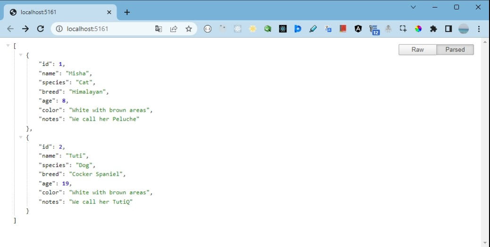
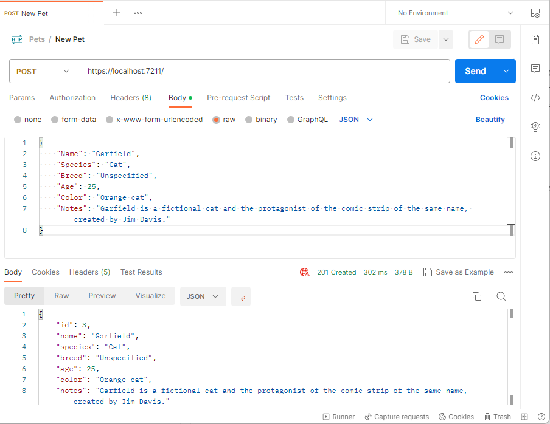

<h1>Proof of Concept of Minimal APIs with .NET 7.0</h1>

Minimal APIs are a new feature in .NET 7.0 that allows developers to build HTTP APIs with minimal coding, setup, and configuration. It simplifies the process of setting up a web API project and allows for a more concise programming model.  
This is a proof of concept for using minimal APIs to create a simple API that allows to:

- Get a list of pets
- Get a single pet.
- Create a new pet.

 

It's a full fledged API with a Sql Server database, unit testing and everything. It's just a proof of concept, so it's not perfect, but it works and demonstrates the concept offered by Minimal APIs.

<h2>Prerrequisites</h2>

- .Net 7.0
- Microsoft SQL Server

<h2>Steps Outlined</h2>

1. Clone the repository.
2. Either open the solution file with Visual Studio or use the dotnet CLI. If you opt to use the dotnet CLI follow steps 3 through 8, if you don't want to use the dotnet CLI then just do the following after opening the solution file in Visual Studio:
   - Restore NuGet packages for the whole solution.
   - Run the database migrations located in MyMinimalApi.Data.Migrations directory, and insert some seed data into the PetDb database.
   - Build the solution
   - Run it
   - Play with the API either directly in the browser or using the Postman tool.
3. Go to the root folder of your local repository.
4. Restore the NuGet packages used. Basically they are:
   - Microsoft EntityFrameworkCore
   - Microsoft EntityFrameworkCore for Sql Server
   - Microsoft EntityFramework InMemory
   - Microsoft AspNetCore TestHost
   - Microsoft Extensions
   - Microsoft.Net Test SDK
   - xunit
   - Moq
   - Coverlet Collector
5. Build the solution using the following command: `dotnet build`.
6. Run the database migrations located in MyMinimalApi.Data.Migrations directory, and insert some seed data into the PetDb database.
7. Go to the MyMinimalApi project directory.
8. Run the MyMinimalApi project using the following command: `dotnet run`.
9. Play with the API either directly in the browser or using the Postman tool.
10. Go to the MyMinimalApi project directory.
11. Run the MyMinimalApi project using the following command: `dotnet run`.
12. Play with the API either directly in the browser or using the Postman tool.

Et voilà!
 

 
 

